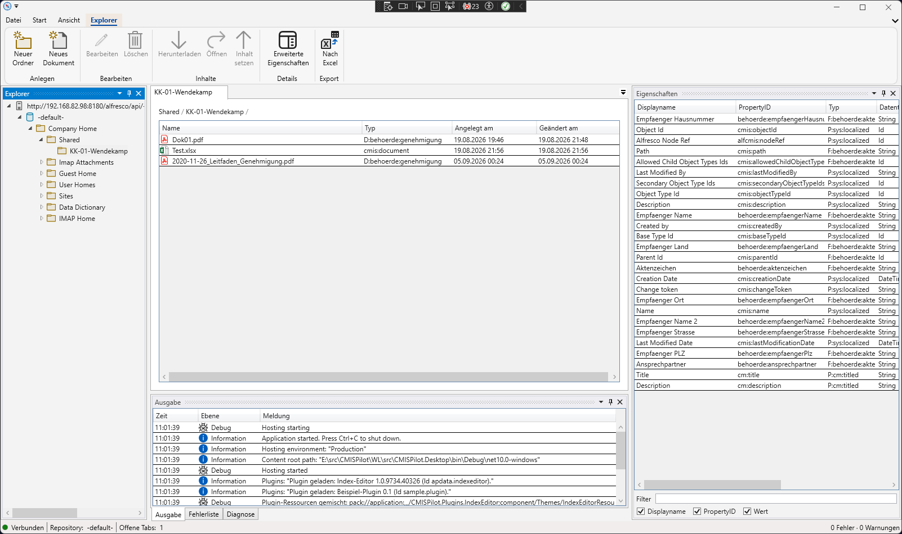
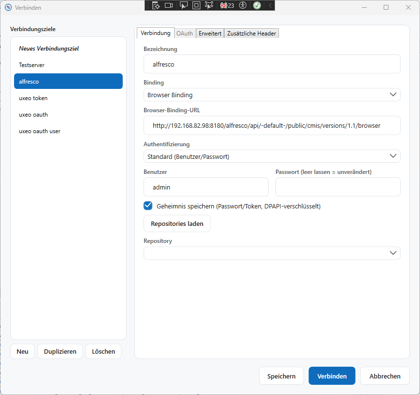

# CMISPilot

> 🇬🇧 **English version:** Available here as [README.md](README.md).

**Ein moderner, freier CMIS-Client und Repository-Explorer für Windows.**

Ein [CMIS](https://www.oasis-open.org/committees/tc_home.php?wg_abbrev=cmis)-Repository (Content Management Interoperability Services) zu durchsuchen, abzufragen und zu debuggen, muss nicht heißen, sich mit der betagten, Eclipse-basierten Apache Chemistry CMIS Workbench herumzuschlagen. **CMISPilot** ist ein schneller, nativer Windows-Desktop-CMIS-Browser und CMIS-Client: Verbinde dich mit jedem CMIS-1.0/1.1-konformen Repository über das JSON-basierte Browser Binding oder das XML-basierte AtomPub Binding, durchsuche den Ordnerbaum, sieh dir Objekt-Properties an und bearbeite sie, führe CMISQL-Abfragen aus und sieh bei Problemen das rohe HTTP-Protokoll ein — alles in einer Ribbon-und-Docking-Oberfläche, die während der Serverkommunikation nie blockiert.


%20%7C%20AtomPub%20(XML)-informational)

---

## Was ist CMISPilot?

CMISPilot ist ein **CMIS-Repository-Explorer** und **CMIS-Client** für Entwickler, Integratoren und Administratoren, die mit Content-Management-Systemen arbeiten, die den Content Management Interoperability Services-Standard implementieren. Man kann es als von Grund auf neu gebaute **Alternative zur Apache Chemistry CMIS Workbench** für modernes Windows verstehen:

- **Moderne Oberfläche statt Relikt.** Eine Fluent-Ribbon- + AvalonDock-Docking-Shell statt eines alten Eclipse-RCP-Fensters — Tabs für Explorer, Query-Konsole und Typen-Browser, dazu andockbare Werkzeugfenster für Ausgabe, Fehlerliste und Diagnose.
- **Blockiert nie.** Jeder Serveraufruf läuft asynchron; die Oberfläche bleibt auch bei einem langsamen oder instabilen Repository reaktionsfähig.
- **Für Troubleshooting gebaut.** Ein rohes HTTP-Protokoll (Methode, URL, Statuscode, Dauer, Content-Type/-Length) ist eingebaut, damit du genau sehen kannst, was CMISPilot gesendet hat und was das Repository geantwortet hat — ganz ohne separates Proxy-Werkzeug.
- **Erweiterbar, ohne aufzublähen.** Firmen- oder projektspezifische Funktionalität kann als Plugin ausgeliefert werden, das sich in Ribbon und Workspace einklinkt, statt fest in der Kernanwendung zu stecken.
- **Ein echter CMIS-Client, kein reiner Viewer.** Volles CRUD für Dokumente und Ordner, versionierungsbewusste Dokumenterstellung und eine CMISQL-Query-Konsole — nicht nur ein schreibgeschützter Blick ins Repository.

## Unterstützte CMIS-Standards

CMISPilot spricht mit Repositories über [PortCMIS](https://chemistry.apache.org/dotnet/portcmis.html), die .NET-Client-Bibliothek von Apache Chemistry, über zwei standardisierte CMIS-Bindings:

| Binding | Format | CMIS-Version | Status |
|---|---|---|---|
| **Browser Binding** | JSON | CMIS 1.1 | ✅ Unterstützt (Standard) |
| **AtomPub Binding** | XML | CMIS 1.0 / 1.1 | ✅ Unterstützt |
| Web Services Binding | SOAP | CMIS 1.0 | ❌ Nicht unterstützt |

Jedes Verbindungsprofil wählt das Binding explizit, sodass du CMISPilot sowohl gegen einen modernen CMIS-1.1-Endpunkt als auch gegen ein älteres, nur-AtomPub-fähiges Repository richten kannst.

## Wichtige Funktionen

- **Explorer** — Ordnerbaum mit Lazy Loading, Properties-Panel, erweiterte/benutzerdefinierte Properties, Zugriff auf Dokumentinhalte.
- **Volles CRUD** — Dokumente und Ordner anlegen, ändern und löschen; der Versionierungsstatus (`Major`/`None`) wird automatisch aus der Typdefinition des Objekts abgeleitet, du musst also nicht raten.
- **Typen-Browser** — Objekttypdefinitionen und Property-Definitionen des verbundenen Repositories einsehen.
- **CMISQL-Query-Konsole** — CMISQL-Abfragen direkt gegen das Repository schreiben und ausführen, Ergebnisse in einer Datentabelle.
- **Diagnose** — rohes HTTP-Request-/Response-Protokoll für das aktive Binding, gezielt für die Fehlersuche bei Verbindungsproblemen zum Repository.
- **Flexible Authentifizierung** — ohne Authentifizierung, HTTP Basic (Benutzername/Passwort) oder OAuth 2.0 Bearer Token.
- **Verbindungsprofile** — Repository-Verbindungen (URL, Binding, Zugangsdaten nur zur Laufzeit) speichern und wiederverwenden, statt sie jedes Mal neu einzutippen.
- **Plugin-System** — firmeneigene Plugins können eigene Ribbon-Tabs und Dokument-Tabs hinzufügen, ohne den CMISPilot-Kern anzufassen (siehe [`samples/SamplePlugin`](samples/SamplePlugin)).
- **Persistiertes Layout** — Fensterposition, Docking-Layout und Einstellungen werden automatisch zwischen den Sitzungen wiederhergestellt.

## Screenshots

**Explorer** — Ordnerbaum, Dokumentliste und das Eigenschaften-Panel:



**Verbinden-Dialog** — gespeicherte Verbindungsprofile links, Verbindungseinstellungen rechts:



## Kompatible Repositories

CMISPilot spricht den offenen CMIS-Standard statt einer herstellerspezifischen API und ist damit für **jedes CMIS-1.0/1.1-konforme Repository** ausgelegt — unter anderem:

- **Alfresco**
- **Nuxeo**
- **OpenText Content Server / Documentum**
- **IBM FileNet Content Manager**
- **Microsoft SharePoint** (über einen CMIS-Connector)
- **Apache Chemistry OpenCMIS**-basierte Server

Aktiv entwickelt und getestet wird gegen einen OpenCMIS-InMemory-Testserver; die Kompatibilität mit anderen Repositories ergibt sich direkt aus deren CMIS-Konformität, nicht aus repository-spezifischen Integrationstests.

## Schnellstart

CMISPilot hängt von zwei Schwesterprojekten ab — [`APX.PortCMIS`](https://github.com/apdata/APX.PortCMIS) (die CMIS-Client-Bibliothek) und [`APX.Wpf.Shell`](https://github.com/apdata/APX.Wpf.Shell) (die gemeinsame WPF-Shell) —, die daneben ausgecheckt werden müssen:

```bash
# 1. CMISPilot und seine beiden Abhängigkeiten in einen gemeinsamen Ordner klonen
git clone https://github.com/apdata/CMISPilot.git
git clone https://github.com/apdata/APX.PortCMIS.git
git clone https://github.com/apdata/APX.Wpf.Shell.git

# 2. Bauen
cd CMISPilot
dotnet build src/CMISPilot.sln -c Release

# 3. Starten
dotnet run --project src/CMISPilot.Desktop -c Release
```

Voraussetzung: **.NET 10 SDK** und **Windows** (CMISPilot ist eine WPF-Desktop-Anwendung).

## Verwendung

1. **Verbinden** — den Verbindungsdialog öffnen, Browser- oder AtomPub-Binding wählen, Repository-URL und Zugangsdaten (oder ein OAuth-2.0-Bearer-Token) eingeben und ein Repository auswählen.
2. **Erkunden** — der Ordnerbaum lädt lazy; ein Klick auf einen Ordner öffnet ihn als Explorer-Tab und zeigt/erlaubt das Bearbeiten der Objekt-Properties.
3. **Abfragen** — den Query-Tab öffnen und CMISQL gegen das verbundene Repository ausführen.
4. **Troubleshooting** — das Diagnose-Werkzeugfenster öffnen, um den rohen HTTP-Traffic des aktiven Bindings zu sehen.

Mit Verbindungsprofilen kannst du eine Repository-Verbindung (Name, URL, Binding, Authentifizierungsart) speichern, statt den Verbindungsdialog jedes Mal neu auszufüllen.

## Mitwirken

Firmen- oder projektspezifische Funktionalität gehört in ein Plugin, nicht in den CMISPilot-Kern — siehe [`samples/SamplePlugin`](samples/SamplePlugin) für einen minimalen, dokumentierten Einstieg in das Plugin-Beitragsmodell (Ribbon-Tabs, Dokument-Tabs).

Issues und Pull Requests sind willkommen.

## Unterstützung

CMISPilot ist frei, quelloffen und entsteht in der Freizeit neben dem Tagesjob. Wenn es dir Zeit oder Nerven beim Umgang mit einem CMIS-Repository erspart hat, kannst du mir [einen Kaffee spendieren](https://buymeacoffee.com/apdata) — das hilft, das Projekt am Laufen zu halten.

## Lizenz

Für dieses Repository wurde bisher keine Lizenz veröffentlicht. Bis eine Lizenzdatei hinzugefügt wird, liegen alle Rechte beim Urheber, und es werden keine Nutzungs-, Änderungs- oder Weiterverbreitungsrechte eingeräumt.
